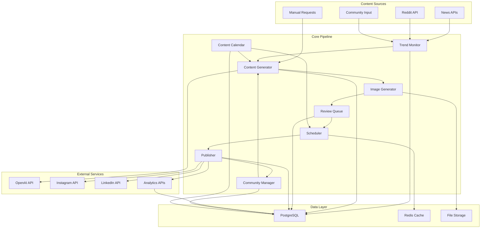

# Design Document

## Overview

The Based Labs Automated Content Pipeline is designed as a modular, event-driven system that transforms content curation into published social media posts. The architecture prioritizes maintainability, scalability, and brand consistency while enabling a solo operator to manage high-quality content at scale.

The system follows a microservices-inspired approach with clear separation of concerns: content curation, AI generation, image processing, publishing, and analytics. Each component can be developed, tested, and scaled independently while maintaining tight integration through well-defined APIs.

## Architecture

### High-Level System Architecture



### Component Architecture

The system is built using FastAPI as the core framework with the following key components:

1. **Trend Monitor Service**: Continuously monitors external sources for content opportunities
2. **Content Generation Service**: Uses AI to create brand-consistent content
3. **Image Generation Service**: Creates professional visuals using the existing BasedLabsImageGenerator
4. **Review and Approval Service**: Manages human oversight workflow
5. **Publishing Service**: Handles multi-platform posting and scheduling
6. **Analytics Service**: Tracks performance and provides insights
7. **Community Engagement Service**: Manages community interactions and response suggestions
8. **Content Calendar Service**: Provides planning and campaign management capabilities
9. **Orchestration Service**: Coordinates the entire pipeline

## Components and Interfaces

### 1. Trend Monitor Service

**Purpose**: Continuously scan external sources for content opportunities aligned with Based Labs themes.

**Key Interfaces**:
```python
class TrendMonitorService:
    async def scan_news_sources() -> List[TrendOpportunity]
    async def analyze_reddit_discussions() -> List[TrendOpportunity]
    async def process_community_input() -> List[TrendOpportunity]
    async def score_opportunity(opportunity: TrendOpportunity) -> float
```

**Data Sources**:
- News APIs (NewsAPI, Reddit API)
- RSS feeds from relevant publications
- Community Discord/Telegram channels
- Manual trend submissions

**Scoring Algorithm**:
- Brand alignment (40%): System friction, permission barriers, gatekeeping mechanisms, individual workarounds
- Timeliness (30%): Trending topics, breaking news, community discussions
- Engagement potential (20%): Historical performance of similar content, provocative level alignment (7/10)
- Uniqueness (10%): Differentiation from existing content

**Community Input Processing**:
- Comment and question analysis for content ideas
- Identification of common frustrations and system barriers
- Conversion of community discussions into content opportunities

### 2. Content Generation Service

**Purpose**: Transform trend opportunities into brand-consistent content using AI.

**Key Interfaces**:
```python
class ContentGenerationService:
    async def generate_content(opportunity: TrendOpportunity) -> GeneratedContent
    async def select_template(content: GeneratedContent) -> str
    async def validate_brand_voice(content: GeneratedContent) -> bool
    async def optimize_for_platform(content: GeneratedContent, platform: str) -> GeneratedContent
```

**AI Integration**:
- OpenAI GPT-4 with custom system prompts enforcing 7/10 provocative level
- Based Labs steering files integration for brand voice consistency
- Proven hook formulas: "You're waiting for permission that will never come", "This rule made sense in 1950. It's destroying you in 2025"
- Template selection logic based on character count and content analysis
- Quality validation with automatic regeneration until standards are met

**Content Types and Selection Logic**:
- Quote posts: Provocative statements under 100 characters (quote_minimal template)
- Long-form posts: Educational content 100-800 characters (long_form template)
- Carousel series: Multi-slide content over 800 characters (carousel format)
- Automatic content type detection based on character count and content structure

**Content Quality Requirements**:
- Clear value proposition for the reader
- Specific next action or call-to-action
- Connection to Based Labs philosophy (agency, systems, decentralization)
- Adherence to 7/10 provocative level calibration

### 3. Image Generation Service

**Purpose**: Create professional visuals using the existing BasedLabsImageGenerator.

**Key Interfaces**:
```python
class ImageGenerationService:
    async def generate_image(content: GeneratedContent, template: str) -> Image
    async def apply_brand_effects(image: Image) -> Image
    async def optimize_for_platform(image: Image, platform: str) -> Image
    async def generate_variations(content: GeneratedContent) -> List[Image]
```

**Integration with Existing System**:
- Extends current BasedLabsImageGenerator
- Maintains existing template system
- Preserves professional effects pipeline
- Adds batch processing capabilities

### 4. Review and Approval Service

**Purpose**: Manage human oversight workflow for content quality control.

**Key Interfaces**:
```python
class ReviewService:
    async def queue_for_review(content_package: ContentPackage) -> str
    async def get_pending_reviews() -> List[ContentPackage]
    async def approve_content(review_id: str, feedback: str) -> bool
    async def reject_content(review_id: str, feedback: str) -> bool
```

**Review Dashboard Features**:
- Side-by-side content and image preview
- Brand guideline checklist
- One-click approval/rejection
- Feedback collection for AI improvement
- Batch review capabilities

### 5. Publishing Service

**Purpose**: Handle multi-platform posting and scheduling.

**Key Interfaces**:
```python
class PublishingService:
    async def schedule_post(content_package: ContentPackage, platform: str, schedule_time: datetime) -> str
    async def publish_immediately(content_package: ContentPackage, platform: str) -> PublishResult
    async def get_optimal_posting_time(platform: str, content_type: str) -> datetime
    async def handle_publishing_failure(post_id: str, error: str) -> None
```

**Platform Integrations**:
- Instagram: Creator Studio API with visual-first optimization and scroll-stopping hooks
- LinkedIn: LinkedIn API v2 with professional/business context framing for thought leadership
- Platform-specific hashtag generation (#agency #systems #decentralized #futureofwork for Instagram)
- Future platforms: Extensible adapter pattern

**Scheduling Logic**:
- Optimal timing: Instagram (11 AM, 2 PM, 5 PM EST), LinkedIn (8 AM, 12 PM, 6 PM EST)
- Weekly content mix: Monday (system critique), Wednesday (framework/tool), Friday (community spotlight)
- Content mix balancing with automatic adjustment recommendations
- Rate limiting and API quota management
- Automatic carousel creation for content exceeding platform limits

### 6. Analytics Service

**Purpose**: Track performance and provide insights for continuous improvement.

**Key Interfaces**:
```python
class AnalyticsService:
    async def track_post_performance(post_id: str, metrics: PostMetrics) -> None
    async def analyze_content_patterns() -> ContentInsights
    async def generate_performance_report(timeframe: str) -> PerformanceReport
    async def identify_optimization_opportunities() -> List[Optimization]
```

### 7. Community Engagement Service

**Purpose**: Manage community interactions and convert engagement into content opportunities.

**Key Interfaces**:
```python
class CommunityEngagementService:
    async def categorize_comments(comments: List[Comment]) -> Dict[str, List[Comment]]
    async def identify_content_opportunities(comments: List[Comment]) -> List[ContentOpportunity]
    async def generate_response_suggestions(message: str, context: str) -> List[ResponseSuggestion]
    async def analyze_community_sentiment(interactions: List[Interaction]) -> SentimentAnalysis
    async def provide_criticism_guidance(feedback: str) -> ResponseGuidance
```

**Comment Categorization**:
- Questions: Opportunities for educational content
- Feedback: Insights for content improvement
- Spam: Automatic filtering and removal
- Engagement: High-value interactions for community building

**Response Generation**:
- Based Labs engagement templates integration
- Context-aware suggestions using AI
- Constructive criticism handling guidelines
- Community question conversion to content topics

### 8. Content Calendar Service

**Purpose**: Provide strategic content planning and campaign management capabilities.

**Key Interfaces**:
```python
class ContentCalendarService:
    async def get_content_calendar(timeframe: str) -> ContentCalendar
    async def identify_content_gaps() -> List[ContentGap]
    async def suggest_campaign_content(theme: str, duration: int) -> List[ContentSuggestion]
    async def balance_content_pillars() -> ContentBalanceReport
    async def schedule_special_events(events: List[Event]) -> List[ContentOpportunity]
```

**Calendar Features**:
- Scheduled posts visualization with content themes
- Content pillar distribution tracking (system critique, frameworks, community)
- Campaign planning with manual content request capabilities
- Special event and date-based content suggestions
- Content gap identification and filling recommendations
- Posting frequency optimization

**Metrics Tracked**:
- Engagement rates (likes, comments, shares, saves) with 2% threshold monitoring
- Save rates with 1% threshold for practical value assessment
- Click-through rates to newsletter/website
- Audience growth and retention
- Content type performance comparison (hooks, topics, formats, timing)
- Optimal posting time analysis
- Performance pattern identification for high-performing content

**Performance-Based Learning**:
- Automatic flagging when engagement falls below 2%
- Suggestions for increasing provocative level or improving hooks
- Practical value enhancement recommendations for low save rates
- Continuous feedback loop into content generation algorithms

## Data Models

### Core Data Structures

```python
@dataclass
class TrendOpportunity:
    id: str
    source: str  # news, reddit, community, manual
    title: str
    description: str
    url: Optional[str]
    relevance_score: float
    created_at: datetime
    processed: bool

@dataclass
class GeneratedContent:
    id: str
    opportunity_id: str
    content_type: str  # quote, long_form, carousel
    main_text: str
    title: Optional[str]
    description: Optional[str]
    cta: Optional[str]
    attribution: Optional[str]
    template_suggestion: str
    brand_voice_score: float
    created_at: datetime

@dataclass
class ContentPackage:
    id: str
    content: GeneratedContent
    image_path: str
    platform: str
    status: str  # pending, approved, rejected, scheduled, published
    review_feedback: Optional[str]
    scheduled_time: Optional[datetime]
    published_time: Optional[datetime]

@dataclass
class PostMetrics:
    post_id: str
    platform: str
    likes: int
    comments: int
    shares: int
    saves: int
    impressions: int
    reach: int
    click_through_rate: float
    engagement_rate: float
    collected_at: datetime

@dataclass
class Comment:
    id: str
    post_id: str
    platform: str
    author: str
    text: str
    category: str  # question, feedback, spam, engagement
    sentiment: float
    created_at: datetime

@dataclass
class ResponseSuggestion:
    comment_id: str
    suggested_response: str
    response_type: str  # educational, engagement, redirect
    confidence_score: float
    template_used: str

@dataclass
class ContentCalendarEntry:
    id: str
    scheduled_date: datetime
    content_theme: str  # system_critique, framework, community_spotlight
    platform: str
    status: str  # planned, generated, approved, published
    content_pillar: str
```

### Database Schema

```sql
-- Trend opportunities
CREATE TABLE trend_opportunities (
    id UUID PRIMARY KEY DEFAULT gen_random_uuid(),
    source VARCHAR(50) NOT NULL,
    title TEXT NOT NULL,
    description TEXT,
    url TEXT,
    relevance_score FLOAT,
    created_at TIMESTAMP DEFAULT NOW(),
    processed BOOLEAN DEFAULT FALSE
);

-- Generated content
CREATE TABLE generated_content (
    id UUID PRIMARY KEY DEFAULT gen_random_uuid(),
    opportunity_id UUID REFERENCES trend_opportunities(id),
    content_type VARCHAR(20) NOT NULL,
    main_text TEXT NOT NULL,
    title TEXT,
    description TEXT,
    cta TEXT,
    attribution TEXT,
    template_suggestion VARCHAR(50),
    brand_voice_score FLOAT,
    created_at TIMESTAMP DEFAULT NOW()
);

-- Content packages (content + image + metadata)
CREATE TABLE content_packages (
    id UUID PRIMARY KEY DEFAULT gen_random_uuid(),
    content_id UUID REFERENCES generated_content(id),
    image_path TEXT,
    platform VARCHAR(20),
    status VARCHAR(20) DEFAULT 'pending',
    review_feedback TEXT,
    scheduled_time TIMESTAMP,
    published_time TIMESTAMP,
    created_at TIMESTAMP DEFAULT NOW()
);

-- Post performance metrics
CREATE TABLE post_metrics (
    id UUID PRIMARY KEY DEFAULT gen_random_uuid(),
    package_id UUID REFERENCES content_packages(id),
    platform VARCHAR(20),
    likes INTEGER DEFAULT 0,
    comments INTEGER DEFAULT 0,
    shares INTEGER DEFAULT 0,
    saves INTEGER DEFAULT 0,
    impressions INTEGER DEFAULT 0,
    reach INTEGER DEFAULT 0,
    click_through_rate FLOAT DEFAULT 0,
    engagement_rate FLOAT DEFAULT 0,
    collected_at TIMESTAMP DEFAULT NOW()
);

-- Community comments and interactions
CREATE TABLE comments (
    id UUID PRIMARY KEY DEFAULT gen_random_uuid(),
    post_id VARCHAR(100),
    platform VARCHAR(20),
    author VARCHAR(100),
    text TEXT,
    category VARCHAR(20), -- question, feedback, spam, engagement
    sentiment FLOAT,
    created_at TIMESTAMP DEFAULT NOW()
);

-- Response suggestions for community management
CREATE TABLE response_suggestions (
    id UUID PRIMARY KEY DEFAULT gen_random_uuid(),
    comment_id UUID REFERENCES comments(id),
    suggested_response TEXT,
    response_type VARCHAR(20), -- educational, engagement, redirect
    confidence_score FLOAT,
    template_used VARCHAR(50),
    created_at TIMESTAMP DEFAULT NOW()
);

-- Content calendar entries
CREATE TABLE content_calendar (
    id UUID PRIMARY KEY DEFAULT gen_random_uuid(),
    scheduled_date TIMESTAMP,
    content_theme VARCHAR(50), -- system_critique, framework, community_spotlight
    platform VARCHAR(20),
    status VARCHAR(20) DEFAULT 'planned', -- planned, generated, approved, published
    content_pillar VARCHAR(50),
    package_id UUID REFERENCES content_packages(id),
    created_at TIMESTAMP DEFAULT NOW()
);

-- System configuration
CREATE TABLE system_config (
    key VARCHAR(100) PRIMARY KEY,
    value JSONB,
    updated_at TIMESTAMP DEFAULT NOW()
);
```

## Error Handling

### Error Categories and Strategies

1. **External API Failures**
   - Retry with exponential backoff
   - Circuit breaker pattern for persistent failures
   - Fallback to cached data when available
   - Graceful degradation of features

2. **Content Generation Failures**
   - Multiple AI model fallbacks (GPT-4 → GPT-3.5 → Claude)
   - Template-based content generation as last resort
   - Human notification for persistent failures
   - Content queue management to prevent blocking

3. **Image Generation Failures**
   - Fallback to simpler templates
   - Text-only content options
   - Error logging with context for debugging
   - Automatic retry with different parameters

4. **Publishing Failures**
   - Automatic retry with different timing
   - Manual publishing workflow as fallback
   - Platform-specific error handling (Instagram Creator Studio API, LinkedIn API v2)
   - User notification with manual posting instructions
   - Automatic carousel creation for content exceeding platform limits

5. **Review Process Failures**
   - 24-hour reminder notifications for pending reviews
   - Escalation workflows for overdue approvals
   - Feedback collection and learning integration
   - Quality filter bypass for urgent content

### Error Recovery Workflows

```python
class ErrorHandler:
    async def handle_api_failure(service: str, error: Exception) -> RecoveryAction
    async def handle_content_generation_failure(opportunity: TrendOpportunity) -> RecoveryAction
    async def handle_publishing_failure(package: ContentPackage) -> RecoveryAction
    async def escalate_to_human(error_context: ErrorContext) -> None
```

## Testing Strategy

### Unit Testing
- Individual service components
- Data model validation
- Business logic functions
- Error handling scenarios

### Integration Testing
- API endpoint testing
- Database operations
- External service integrations
- End-to-end pipeline flows

### Performance Testing
- Content generation throughput
- Image processing speed
- Database query optimization
- API response times

### Brand Consistency Testing
- Automated brand voice validation with 7/10 provocative level verification
- Template rendering verification (quote_minimal, long_form, carousel)
- Content quality scoring against Based Labs guidelines
- Visual brand compliance (neon green #00ff00, black backgrounds, high contrast)
- Hook formula validation and effectiveness testing

### Community Engagement Testing
- Comment categorization accuracy testing
- Response suggestion quality validation
- Sentiment analysis accuracy verification
- Content opportunity identification from community input

### Content Calendar Testing
- Content pillar distribution validation
- Scheduling optimization verification
- Campaign planning functionality testing
- Content gap identification accuracy

### Test Data Management
```python
# Test fixtures for consistent testing
@pytest.fixture
def sample_trend_opportunity():
    return TrendOpportunity(
        source="news",
        title="New AI regulation proposed",
        description="Government proposes new AI oversight rules",
        relevance_score=0.85
    )

@pytest.fixture
def sample_generated_content():
    return GeneratedContent(
        content_type="quote",
        main_text="You don't need permission to innovate",
        template_suggestion="quote_post",
        brand_voice_score=0.9
    )
```

### Continuous Integration Pipeline
1. **Code Quality**: Black formatting, type checking, linting
2. **Unit Tests**: 90%+ coverage requirement
3. **Integration Tests**: API and database testing
4. **Brand Compliance**: Automated brand voice validation
5. **Performance Tests**: Response time and throughput benchmarks
6. **Security Scanning**: Dependency and code security analysis

This design provides a robust, scalable foundation for your automated content pipeline while maintaining the quality and brand consistency that Based Labs requires. The modular architecture allows for incremental development and easy maintenance as the system grows.